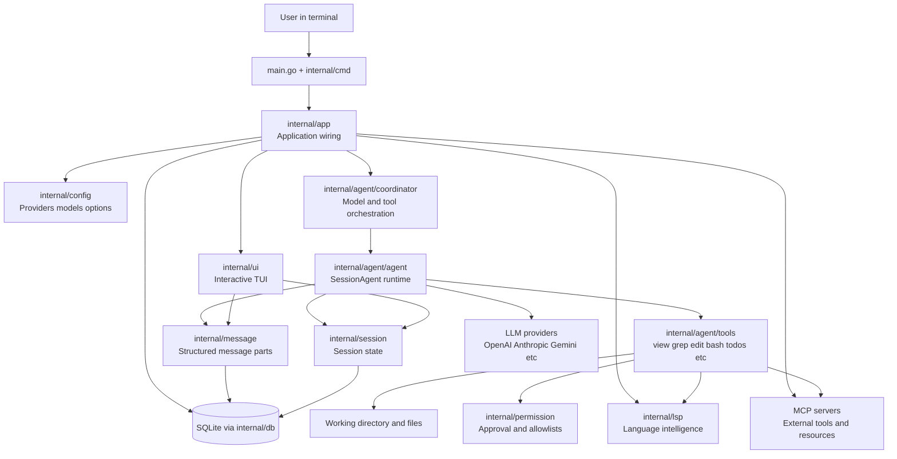
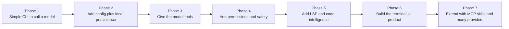
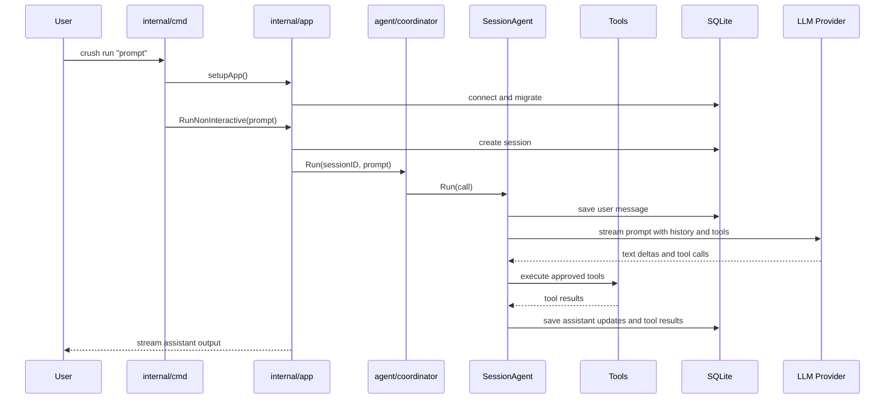

# Crush Project Walkthrough

This document explains the repo from the perspective of a developer who might
have built it from scratch and then kept growing it into a production-ready
terminal AI assistant.

It is not just a folder tour. The goal is to help you understand:

- what problem this project is solving
- what the first version probably looked like
- why each major subsystem exists
- how data and control move through the app
- how to reason about the code when making changes

---

## 1. Start with the product idea

Before looking at code, it helps to imagine the original product thought:

> "I want an AI coding assistant that lives in the terminal, can see my repo,
> use tools safely, remember sessions, and feel like a real developer utility
> rather than a toy chat box."

That one sentence explains most of the repo.

A terminal AI assistant needs more than a plain LLM wrapper. It needs:

1. a CLI entrypoint
2. an interactive terminal UI
3. configuration for models and providers
4. persistent sessions and message history
5. tools that let the model inspect and edit code
6. permission controls so tools are not dangerous by default
7. language-aware help through LSP
8. extensibility through MCP and skills
9. eventing and background orchestration

That is why this repository feels broader than a simple CLI app.

---

## 2. The likely evolution of the system

A useful way to understand the repo is to imagine the order a developer would
have built it.

### Phase 1: make a CLI that can call a model

The smallest useful version would be:

- parse a command like `crush run "hello"`
- load provider credentials
- send a prompt to an LLM
- print the answer

You can still see that skeleton today:

- `main.go:13-23` starts the program
- `internal/cmd/run.go:16-80` handles non-interactive execution
- `internal/cmd/root.go:181-228` bootstraps config, DB, and app wiring

This is the first mental anchor: **Crush is still fundamentally a CLI program
that can execute one prompt and return one response.**

### Phase 2: make it usable every day

A raw one-shot command is not enough for real work. A developer would quickly
want:

- saved conversations
- project-aware context
- configurable providers and models
- repeatable setup

That likely led to:

- config loading in `internal/config/`
- SQLite persistence in `internal/db/`
- session storage in `internal/session/`
- message storage in `internal/message/`

This is where Crush stops being "a script around an API" and becomes "an
application with state."

### Phase 3: give the model tools

A coding assistant without tools is weak. The next natural step is:

> "Let the model read files, search code, edit files, run commands, and inspect
> structure."

That explains `internal/agent/tools/`.

Instead of building one giant magical agent, the project gives the model a
carefully designed toolbelt:

- `view`, `grep`, `glob`, `ls` for understanding code
- `edit`, `multiedit`, `write` for changing code
- `bash` for command execution
- `fetch`, `agentic_fetch`, `download` for web/data access
- `lsp_*` tools for semantic code understanding
- `todos` for task tracking

This is the second major architectural idea:

> **The model is not trusted to directly modify the world. It operates through
> structured tools.**

### Phase 4: add guardrails

As soon as you give an AI tools, the next developer thought is:

> "How do I keep this safe and understandable?"

That leads directly to:

- permission prompts in `internal/permission/permission.go`
- path-aware approval logic
- session-based auto-approval in non-interactive flows
- allowed-tool lists in config

This project is not just trying to be powerful. It is trying to be safely
powerful.

### Phase 5: improve code intelligence

Basic file search is useful, but a coding assistant becomes much better if it
can understand symbols, references, and diagnostics.

That is why LSP exists here:

- `internal/lsp/manager.go:26-240` lazily starts language servers
- LSP tools expose diagnostics and references to the agent
- the app tracks LSP state and feeds it back into the interface

This is the point where the product shifts from "AI with shell access" to
"AI that participates in a real development environment."

### Phase 6: make it feel like a product, not just a backend

A daily-use terminal tool needs a good UX:

- interactive UI
- live streaming responses
- session browsing
- dialogs
- diff views
- completions
- animations

That explains the size of `internal/ui/`.

The UI instructions in `internal/ui/AGENTS.md:1-79` show that the team cares
about keeping UI architecture disciplined: main model orchestrates, child
components stay dumb, and expensive work is moved out of `Update`.

### Phase 7: support many providers and extension points

Once the core is solid, the next product pressure is flexibility:

- support many LLM providers
- handle OAuth and API key flows
- let users add MCP servers
- let users add reusable skill packs

That shows up in:

- `internal/config/config.go:97-260` for provider, MCP, LSP, and option types
- `internal/config/load.go:70-240` for merging provider definitions and env
- `internal/agent/tools/mcp/` for MCP integration
- `internal/skills/skills.go:1-183` for skill discovery and prompt injection

At this stage, Crush becomes a platform, not just a single fixed assistant.

## Architecture diagram

## Build-up timeline diagram

---

## 3. The core concept: this repo is a layered system

You can understand the codebase as six layers.

## Layer 1: entrypoints

These are how the outside world enters the app.

- `main.go` — process entry
- `internal/cmd/` — Cobra commands and CLI behavior
- `internal/ui/` — interactive terminal experience

Question this layer answers:

> How does the user start and interact with the program?

## Layer 2: application wiring

This is where services are created and connected.

- `internal/app/app.go`

Question this layer answers:

> What services exist, and how are they connected for one running app
> instance?

## Layer 3: agent runtime

This is the heart of the product.

- `internal/agent/agent.go`
- `internal/agent/coordinator.go`
- `internal/agent/prompts.go`
- `internal/agent/templates/`

Question this layer answers:

> How does a prompt become an LLM call with history, tools, streaming,
> retries, and side effects?

## Layer 4: project intelligence and execution

These are the capabilities the model uses.

- `internal/agent/tools/`
- `internal/lsp/`
- `internal/shell/`
- `internal/skills/`
- MCP integration

Question this layer answers:

> How does the model inspect, reason about, and act on the developer's world?

## Layer 5: persistence and domain state

These packages keep the app grounded over time.

- `internal/db/`
- `internal/session/`
- `internal/message/`
- `internal/history/`
- `internal/filetracker/`
- `internal/projects/`

Question this layer answers:

> What state is remembered, and how is it stored?

## Layer 6: policy and safety

These packages shape how power is controlled.

- `internal/config/`
- `internal/permission/`
- parts of `internal/event/`

Question this layer answers:

> What is allowed, what is configured, and what should be observed?

---

## 4. How to think like the original developer

If you want to work in this repo well, think in the same order the developer
probably had to think.

### Step 1: define the user journey

The primary user journey is something like:

1. open Crush in a repo
2. choose or configure a model/provider
3. ask a question or request a change
4. let the agent inspect files and run tools
5. stream results back live
6. preserve that work in session history

Almost every subsystem exists to make that journey reliable.

### Step 2: separate "chat" from "application"

A common mistake would be to store everything inside a single giant chat model.
This repo avoids that.

Instead, the developer separated:

- **UI state** from **agent state**
- **message persistence** from **runtime orchestration**
- **permissions** from **tool logic**
- **provider configuration** from **agent execution**

That separation is why the project scales.

### Step 3: treat the model as a worker, not as the app itself

The app is not "the LLM."

The LLM is one component inside a bigger system that provides:

- prompts
- tools
- permissions
- storage
- structured messages
- retries
- model switching
- token accounting

This is the most important mindset in the repo.

> **The application owns the workflow. The model participates in it.**

### Step 4: make everything observable

When agents stream partial text, call tools, fail, retry, or summarize, you
need visibility.

That is why messages are not stored as plain text blobs. Message content is
structured in parts.

See `internal/message/content.go:18-260`:

- assistant text
- reasoning content
- tool calls
- tool results
- finish states
- binary/image attachments

This is a very product-minded design. It allows the UI and runtime to observe
not just the final answer, but the shape of the interaction.

### Step 5: support incomplete, real-world environments

A normal developer environment is messy:

- some LSPs are installed, some are not
- some providers are configured, some are not
- some tools should prompt for permission
- some repos are not even git repos

The project handles that reality rather than assuming a perfect setup.

Examples:

- `internal/config/load.go:55-63` reduces file-walk scope outside git repos
- `internal/lsp/manager.go:162-180` skips unavailable or ambiguous LSP servers
- provider setup in `internal/config/load.go:125-240` resolves env/config
  combinations instead of hardcoding one path

That is a sign of mature developer-tool thinking.

---

## 5. The most important execution path in the repo

If you only learn one path, learn this one.

## Flow: `crush run "prompt"`

### A. process startup

- `main.go:13-23` calls `cmd.Execute()`
- Cobra routes to `internal/cmd/run.go:16-80`

### B. app setup

- `internal/cmd/root.go:181-228` resolves cwd, loads config, creates the data
  directory, connects to SQLite, constructs `app.App`

### C. configuration becomes runtime state

- `internal/config/load.go:32-94` loads config and defaults
- provider configs are resolved and merged
- selected models are configured
- agent definitions are prepared

### D. app wires services

- `internal/app/app.go:75-138` creates session/message/history/permission
  services, LSP manager, MCP init, and the main agent coordinator

### E. session starts

- `internal/app/app.go:216-224` creates a session for the run and auto-approves
  permissions for that non-interactive session

### F. coordinator runs the agent

- `internal/agent/coordinator.go:130-207` refreshes models, merges provider
  options, refreshes auth when needed, then delegates to `SessionAgent.Run`

### G. session agent builds one model interaction

- `internal/agent/agent.go:149-245` validates the request, persists the user
  message, loads session history, prepares tool-enabled prompt input, and
  starts streaming from the LLM runtime

### H. streamed callbacks persist everything

- `internal/agent/agent.go:244-429` handles:
  - reasoning deltas
  - text deltas
  - tool calls
  - tool results
  - step finish and token accounting

### I. app streams output to the user

- `internal/app/app.go:245-309` subscribes to message updates and prints live
  assistant output to stdout

That is the system in one line:

> **CLI -> config -> app -> coordinator -> session agent -> tools/provider ->
> message events -> UI/stdout**

## Request flow diagram

---

## 6. Why `app.App` exists

Many repos would spread bootstrapping logic across commands or UI code. This
repo centralizes it.

`internal/app/app.go` exists because once the project grew, the developer
needed one place to wire:

- DB-backed services
- the permission service
- file tracking
- the LSP manager
- MCP lifecycle
- agent coordination
- event subscriptions
- shutdown behavior

That means `App` is not business logic itself. It is a composition root.

When you are lost in the repo, ask:

> Is this code part of the app container, or part of the agent runtime?

That distinction usually clears things up.

---

## 7. Why messages are structured instead of plain text

A simpler app might store each message as just:

- role
- content string

Crush does more. `internal/message/content.go:41-126` defines content parts
such as:

- `TextContent`
- `ReasoningContent`
- `BinaryContent`
- `ToolCall`
- `ToolResult`
- `Finish`

This design solves several real problems:

1. streaming partial text cleanly
2. showing thinking/reasoning separately
3. representing tool use as first-class state
4. attaching images/files
5. rendering richer UI states
6. persisting enough structure to replay or inspect interactions later

This is one of the smartest concepts in the repo.

---

## 8. Why there is both a coordinator and a session agent

At first glance, `internal/agent/coordinator.go` and
`internal/agent/agent.go` may feel overlapping. They are not.

### The coordinator answers

- Which models are selected?
- Which provider config applies?
- Which tools should this agent get?
- Should auth be refreshed?
- Which agent variant are we building: coder or task?

### The session agent answers

- How do I execute one prompt with history and attachments?
- How do I stream deltas into persisted messages?
- How do I queue prompts per session?
- How do I summarize long conversations?
- How do I record tool calls/results and finish state?

So the split is roughly:

- **Coordinator = build and govern the worker**
- **SessionAgent = perform the work for one session**

That is a clean abstraction boundary.

---

## 9. Why tools are a separate subsystem

A naive implementation might put file reading and shell execution directly into
agent code. This repo avoids that by treating tools as a product surface.

That choice gives several benefits:

- each tool can be documented and permissioned individually
- the model sees a curated interface, not raw application internals
- tooling can evolve without rewriting the core agent loop
- multiple agent types can share the same tool inventory selectively

In other words, tools are not utility functions. They are part of the public
contract between the app and the LLM.

---

## 10. Why permissions are central to the design

Once tools exist, permission logic becomes product logic.

`internal/permission/permission.go:45-220` shows the intent clearly:

- some tools/actions can be allowlisted
- some requests can be auto-approved per session
- some approvals can be granted persistently for a path/action combination
- requests are published so UI can present them

This means the developer was thinking about trust boundaries early.

That is important because the app can:

- read local files
- write local files
- execute shell commands
- access network resources

Without a permission layer, this would not be a responsible developer tool.

---

## 11. Why LSP is lazy-loaded

LSP can be expensive, fragile, and language-specific.

`internal/lsp/manager.go:95-240` starts servers only when needed and only when
it makes sense.

That design says the developer wanted:

- language awareness when available
- no heavy startup penalty when not needed
- graceful degradation on machines missing some servers

This is a strong developer-experience decision. The app stays fast and robust
while still gaining semantic power.

---

## 12. Why skills and MCP both exist

These two systems are related but distinct.

### Skills

Skills are prompt-time knowledge packs.

- discovered from `SKILL.md`
- validated and injected into prompts
- useful for reusable instructions or domain-specific behaviors

See `internal/skills/skills.go:112-177`.

### MCP

MCP is runtime capability extension.

- connect external servers
- expose tools/resources dynamically
- widen what the assistant can do beyond built-in functionality

So:

- **skills change what the model knows or is reminded of**
- **MCP changes what the model can actively access and do**

That is a valuable distinction when extending the system.

---

## 13. Why SQLite and sqlc were good choices here

This project needs local persistence, but not a distributed database.

SQLite fits because the product is:

- local-first
- session-oriented
- mostly single-user
- stateful but not massive

`sqlc` fits because the developer likely wanted:

- typed query access
- explicit SQL checked into the repo
- fewer ORM abstractions
- easy migrations and maintainability

This is a very pragmatic stack choice for a terminal app.

---

## 14. What the UI architecture is trying to protect against

Bubble Tea apps can become chaotic if every component owns too much behavior.
The UI guide at `internal/ui/AGENTS.md:21-79` pushes against that.

The design intent appears to be:

- keep orchestration centralized
- keep rendering components simple
- keep side effects out of state mutation code
- preserve predictable message routing

So if you touch the UI, assume the maintainers value explicit control flow more
than cleverness.

---

## 15. How to read this repo effectively

If you are new, do not read every file top-to-bottom. Read in this order.

## Pass 1: product skeleton

1. `README.md`
2. `AGENTS.md`
3. `main.go`
4. `internal/cmd/root.go`
5. `internal/app/app.go`

Goal: understand what the app is and where wiring happens.

## Pass 2: request lifecycle

1. `internal/cmd/run.go`
2. `internal/agent/coordinator.go`
3. `internal/agent/agent.go`
4. `internal/message/`
5. `internal/session/`

Goal: understand how one request becomes stored, streamed, and completed.

## Pass 3: power systems

1. `internal/config/`
2. `internal/agent/tools/`
3. `internal/permission/`
4. `internal/lsp/`
5. `internal/skills/`
6. MCP-related code

Goal: understand where flexibility and safety come from.

## Pass 4: UI and experience

1. `internal/ui/AGENTS.md`
2. `internal/ui/model/`
3. `internal/ui/chat/`
4. `internal/ui/dialog/`
5. `internal/ui/list/`

Goal: understand how the product is presented to the user.

---

## 16. How to make changes without getting lost

When changing behavior, start by locating the layer.

### If the problem is...

- **CLI behavior** -> `internal/cmd/`
- **startup/wiring** -> `internal/app/`
- **provider/model selection** -> `internal/config/` and coordinator
- **message streaming / tool lifecycle** -> `internal/agent/agent.go`
- **tool behavior** -> `internal/agent/tools/`
- **permission prompts** -> `internal/permission/`
- **semantic code intelligence** -> `internal/lsp/`
- **persistence** -> `internal/db/`, `internal/session/`, `internal/message/`
- **TUI rendering** -> `internal/ui/`

That framing saves a lot of time.

---

## 17. The repo's deeper design philosophy

After reading the code, the repo feels guided by a few consistent beliefs.

### 1. Terminal-first does not mean primitive

This is not a tiny shell hack. It is a full application designed for terminal
users.

### 2. AI should operate through explicit capabilities

The model is most useful when given structured tools, not vague hidden powers.

### 3. Safety should be part of the architecture

Permissions, allowlists, and approval flow are built in, not bolted on.

### 4. Local state matters

Sessions, messages, files, todos, and project registration all matter because
coding work is iterative and persistent.

### 5. Flexibility beats lock-in

The provider abstraction, MCP support, and skill loading all point to an
extensible mindset.

### 6. Good DX requires graceful degradation

Not every machine has every provider, LSP, or tool configured. The app is built
to survive that.

---

## 18. If I were the original developer, this is how I would describe the build-out

A believable story of how this project grew would be:

1. Build a CLI that can send prompts to a model.
2. Add config loading so users can bring their own providers.
3. Add local session/message persistence so conversations survive.
4. Add an interactive TUI so the tool feels native to terminal work.
5. Add read/search/edit/bash tools so the model can work on code.
6. Add permissions because tool power needs trust controls.
7. Add structured message parts because plain text is not enough for streaming,
   tool use, and reasoning.
8. Add LSP integration to move from text search to code understanding.
9. Add MCP and skills so the system becomes extensible.
10. Keep refining UX, reliability, and provider flexibility so the tool works
    in messy real-world environments.

That story matches the shape of the codebase very well.

---

## 19. What you should remember most

If you forget everything else, remember these four ideas:

1. **Crush is an application container around an agent runtime.**
2. **The agent works through structured tools, not hidden privileges.**
3. **Messages are structured state, not just chat text.**
4. **The repo is designed for real developer workflows: persistent, local,
   permissioned, extensible, and terminal-native.**

---

## 20. Best next files to study after this

If you want to go deeper, read these next:

- `internal/agent/templates/coder.md.tpl`
- `internal/agent/tools/` descriptions and implementations
- `internal/message/content.go`
- `internal/session/session.go`
- `internal/lsp/client.go`
- `internal/ui/model/`
- `internal/db/sql/`

Those files will turn this mental model into implementation-level confidence.

---

## 21. One-line summary

Crush is a terminal-first AI coding assistant whose real architecture is:

> **a stateful local application that orchestrates LLMs, tools, permissions,
> persistence, and developer context into a usable coding workflow.**
